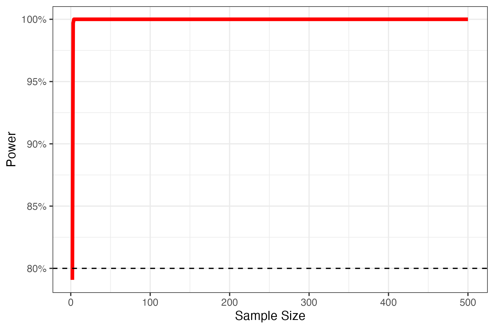
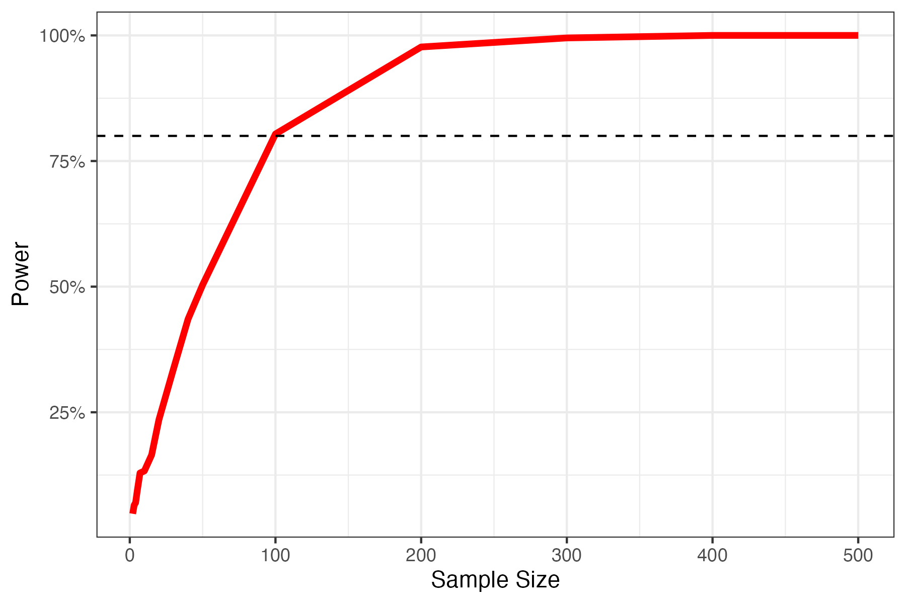
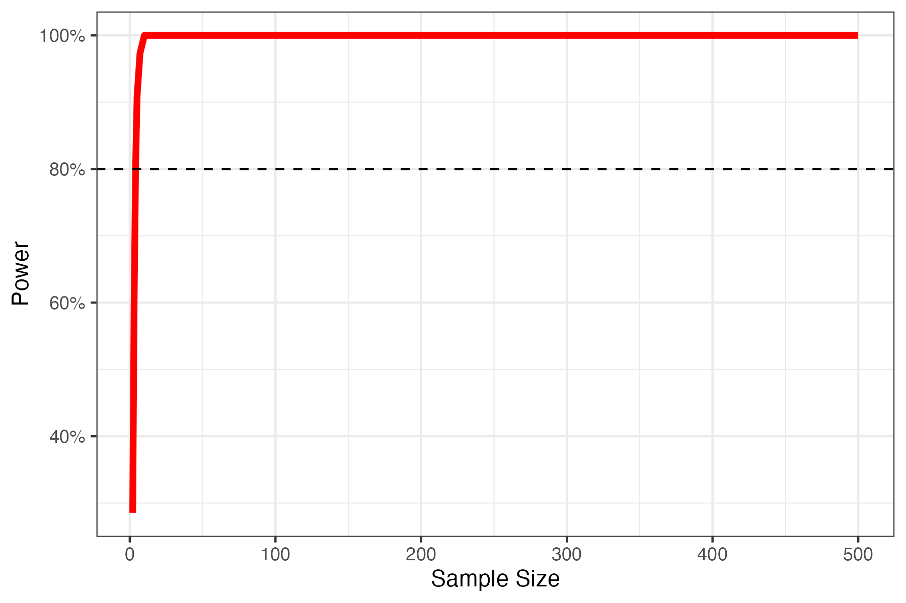

# Power-analysis

Data is obtained from the supplementary material of [Kormann et al.]( https://doi.org/10.1002/eap.2441) (2021), can be found [here](data/overview_herbicide_biodiv_effects.csv). The values do not stand for actual values of species richness, they are the estimated coeficients from linear mixed model outputs. SDs are calculated by dividing the difference between coef estimates and lower/upper 95% CI limits by 1.96.

Detailed code used for analysis is [here](src/03-0.05_intercept.R).

## Question1: Post-hoc power calculation

Detailed results see [here](results/03-power.csv).

## Question2: Minimum sample size required for 80% power

-   Woody, Light \~ Control

-   Woody, Moderate \~ Control

-   Woody, Intensive \~ Control

-   Flower, Light \~ Control

-   Flower, Moderate \~ Control

-   Flower, Intensive \~ Control

